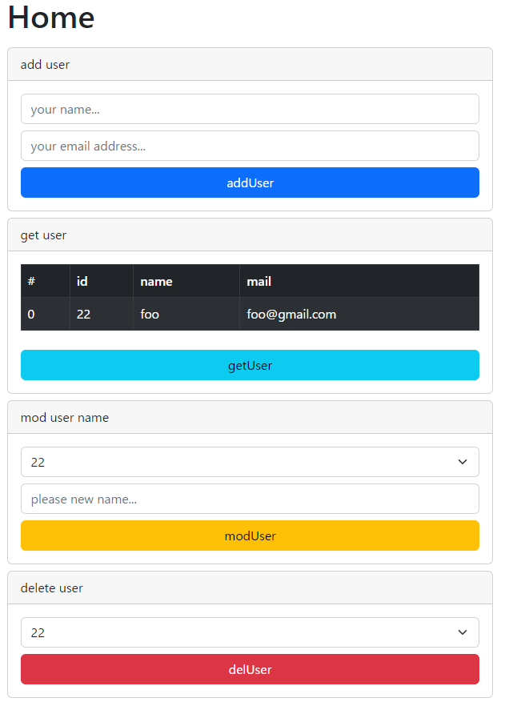
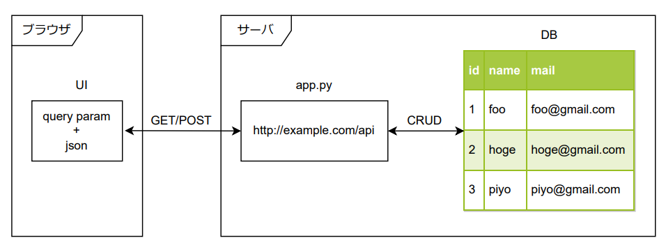
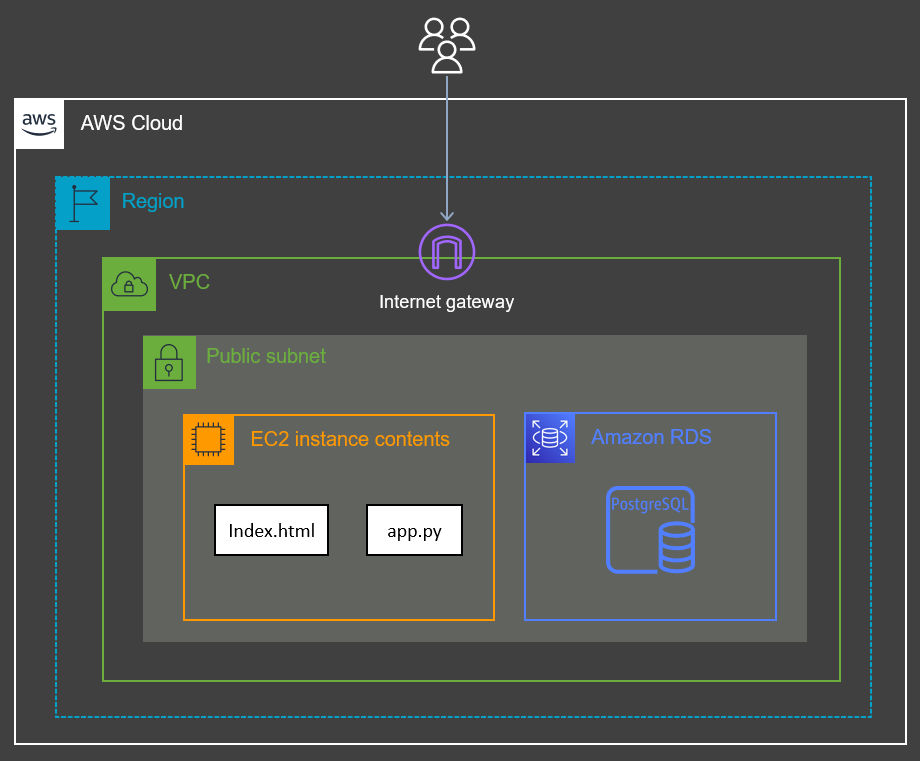

# Please access the finished product at (deployed on Heroku):
https://toyota-fullstack-test.herokuapp.com/index.html 

# How to run:
## Online Live version (deployed on Heroku):
The main page can be accessed at https://toyota-fullstack-test.herokuapp.com/index.html    
### API urls
ユーザー情報の取得：(GET) https://toyota-fullstack-test.herokuapp.com/v1/users?id=all       
ユーザー情報の追加：(POST) https://toyota-fullstack-test.herokuapp.com/v1/users?type=add + {"name":"hoge","mail":"hoge@gmail.com"}    
ユーザー情報の変更：(POST) https://toyota-fullstack-test.herokuapp.com/v1/users?type=mod + {"id":25,"name":"piyopiyo"}      
ユーザー情報の削除：(POST) https://toyota-fullstack-test.herokuapp.com/v1/users?type=del + {"id":25}

## Local version (on your machine):
1. Use the command "pip install -r requirements.txt" to install Python's dependencies.
2. Use the command "npm install" to install Javascript's dependencies.
3. Create a postgresql database with columns {id, name, **email**}, put database information in api/app.py
4. Change directory to api, then use the command "python app.py" to run the backend application.
5. From the root directory of the project, use the command "npm start" to run the frontend application.
6. Access the UI by http://localhost:3000/, access the API by http://127.0.0.1:5000/v1/ (eg. http://127.0.0.1:5000/v1/users?id=all)


# システム開発基礎能力の腕試し

目的１：UI＋API＋DBの基本的なシステムを作成できるかを確認する<br>
目的２：経験のないフレームワークでも自力で調べて作成できるかを確認する<br>
目的３：IPやポートなどネットワーク設定の知識が最低限あるかを確認する<br>

---
## 0.フレームワークと言語

- バックエンド：Flask(Python)
- フロントエンド：React(JavaScript,TypeScript)

---
## 1.WEBアプリケーション作成

- Reactでフロントエンドアプリケーションを開発できる
- HTTP通信でデータを更新・取得できる

リポジトリ内にあるReactのプロジェクトフォルダ(ui)に[デモページ](http://52.199.224.236:5001/)のようなコンポーネントを作成する。<br>
レイアウトは最低限整っていればよしとする。<br>
以下の機能を実装する。<br>
1. デザインは[Bootstrap](https://react-bootstrap.github.io/)を使用する
2. HTTP通信は[axios](https://www.npmjs.com/package/axios)を使用する
3. ユーザー名＋メールアドレスを入力して"addUser"ボタンでDBに登録する
4. DBのusersテーブルの全てのレコードを"getUser"ボタンで取得してテーブルに表示する
5. 対象のIDを選択＋新しい名前を入力して"modUser"ボタンでDBに登録されている名前を変更する
6. 対象のIDを選択して"delUser"ボタンでDBに登録されているレコードを削除する
7. レスポンスのステータスコードに応じてアラートを表示する
8. POSTしたい内容はクエリパラメータに全て記述。またはBodyにJSONで記述の好きなほうでよい



---
## 2.REST APIの作成

- APIのエンドポイント(URI)を設計できる
- GET,POST,DELETEなどのリクエストに対して適切な処理を行うことができる

APIは[Flask](https://flask.palletsprojects.com/en/2.2.x/)を使用して作成する。<br>
ファイルは分割しても良いがメイン処理(GET,POSTまわり)はリポジトリ内の"app.py"に記述する。<br>
以下にURIの例を示す。<br>
ユーザー情報の取得：(GET) http://52.199.224.236:5000/v1/users?id=all<br>
ユーザー情報の追加：(POST) http://52.199.224.236:5000/v1/users?type=add + {"name":"hoge","mail":"hoge@gmail.com"}<br>
ユーザー情報の変更：(POST) http://52.199.224.236:5000/v1/users?type=mod + {"id":25,"name":"piyopiyo"}<br>
ユーザー情報の削除：(POST) http://52.199.224.236:5000/v1/users?type=del + {"id":25}<br>



---
## 3.DBの操作

- DBに対してORMでCRUD処理(Create,Read,Update,Delete)を実行できる

ORMは[SQLAlchemy](https://www.sqlalchemy.org/)を使用する。<br>
SQLAlchemyを使用するならDBの種類は問わない。<br>
以下に作成したテーブルのSQL(PostgreSQL)例を示す。<br>

```
CREATE TABLE IF NOT EXISTS public.users
(
    id integer NOT NULL DEFAULT nextval('users_id_seq'::regclass),
    name character varying(128) COLLATE pg_catalog."default" NOT NULL,
    mail character varying(128) COLLATE pg_catalog."default" NOT NULL,
    CONSTRAINT users_pkey PRIMARY KEY (id),
    CONSTRAINT users_mail_key UNIQUE (mail)
)
```

---
## 4.WEBサーバの構築

- サーバに作成したアプリケーションをデプロイし、サービスを開始できる

AWSやHerokuなどのレンタルサーバを使ってアプリケーションを公開する。<br>
以下にアーキテクチャ(AWS)の例を示す。<br>



---
## 5.提出物
- zipで圧縮したローカルリポジトリ
- 公開したアプリケーションのURL
